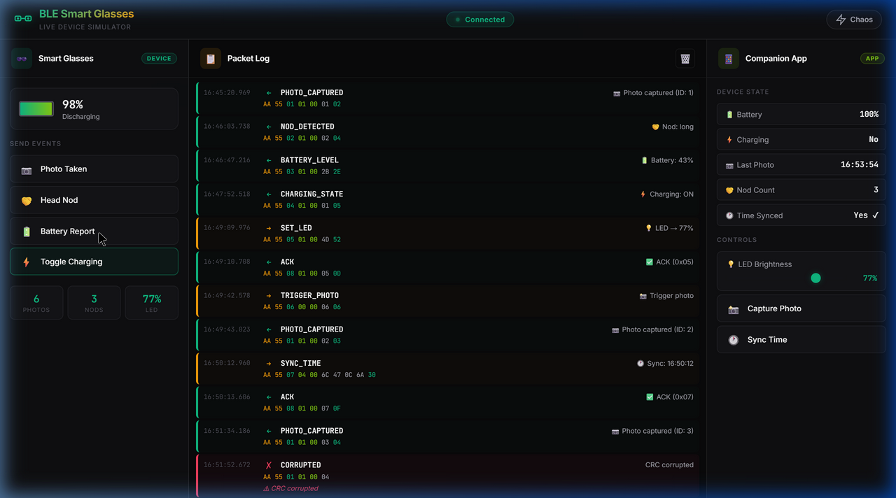

# 🕶️ IoT BLE Smart Glasses — Companion App

> A full-stack IoT prototype: binary protocol parser, live device simulator with chaos testing, and a multilingual voice intent classifier.



---

## 📁 Project Structure

```
iot-ble-smart-glasses/
├── core-1/               # Binary protocol parser + unit tests
│   ├── protocol.js       # buildPacket, parsePacket, parseStream, interpretPacket
│   └── protocol.test.js  # 24 unit tests (node --test)
├── core-2/               # React live device simulator (Vite)
│   ├── src/
│   │   ├── App.jsx       # Main simulator component
│   │   ├── protocol.js   # Protocol module (ES module)
│   │   └── index.css     # Premium dark theme (emerald/amber)
│   └── index.html
├── bonus/                # Voice intent classifier (multilingual)
│   ├── classifier.js     # Weighted keyword scoring engine
│   ├── dataset.js        # 114 labeled test samples (EN/HI/TE)
│   ├── test.js           # Accuracy evaluation + confusion matrix
│   └── DESIGN_DOC.md     # One-page architecture document
├── README.md
└── package.json
```

---

## 🚀 Quick Start

### Prerequisites
- **Node.js** ≥ 18.x

### 1. Protocol Parser Tests
```bash
cd core-1
node --test protocol.test.js
```
```
✔ 24 tests passed | 0 failed | 6 suites
```

### 2. Live Simulator
```bash
cd core-2
npm install
npm run dev
# Opens at http://localhost:3000
```

### 3. Voice Classifier
```bash
cd bonus
node test.js
# Prints accuracy report, confusion matrix, per-language breakdown
```

---

## 📦 Core 1 — Protocol Parser

### Packet Format
```
┌──────────┬──────┬──────────┬──────────────┬─────────┐
│ SYNC (2B)│CMD(1)│ LEN (2B) │ PAYLOAD (NB) │ CRC (1B)│
│ 0xAA 0x55│      │ LE u16   │              │         │
└──────────┴──────┴──────────┴──────────────┴─────────┘
CRC = (CMD + sum(PAYLOAD bytes)) & 0xFF
```

### Commands
| ID | Name | Direction | Payload |
|----|------|-----------|---------|
| `0x01` | PHOTO_CAPTURED | Device → App | `[photoId]` |
| `0x02` | NOD_DETECTED | Device → App | `[type: 0=single, 1=double, 2=long]` |
| `0x03` | BATTERY_LEVEL | Device → App | `[percent]` |
| `0x04` | CHARGING_STATE | Device → App | `[0=off, 1=on]` |
| `0x05` | SET_LED | App → Device | `[brightness 0-100]` |
| `0x06` | TRIGGER_PHOTO | App → Device | `[]` |
| `0x07` | SYNC_TIME | App → Device | `[epoch u32 LE]` |
| `0x08` | ACK | Bidirectional | `[acked_cmd_id]` |
| `0x09` | ERROR | Bidirectional | `[error_code]` |

### API
```javascript
buildPacket(cmd, data)     // → Uint8Array | null
parsePacket(raw)           // → { command, commandName, payload, crc, valid } | null
parseStream(rawBytes)      // → [ parsed packets with .offset ]
interpretPacket(parsed)    // → human-readable string
```

### Edge Cases Handled
- **Null/undefined input** → returns `null`, never throws
- **Truncated packets** → detected via length check before CRC
- **Corrupted CRC** → detected, returns `null`
- **Concatenated streams** → `parseStream()` re-syncs on `0xAA 0x55` markers
- **Garbage between packets** → skipped during stream parsing
- **Invalid command IDs / payload types** → rejected by builder

### Test Coverage (24 tests, 6 suites)
| Suite | Tests | Covers |
|-------|-------|--------|
| Round-Trip Integrity | 4 | Build → parse → verify for all commands |
| CRC Failure Detection | 4 | Flipped CRC, payload, command bytes; CRC formula verification |
| Truncated & Malformed | 5 | Missing CRC, sync-only, empty, null, inflated length |
| Concatenated Streams | 4 | Multi-packet, garbage, corruption recovery |
| Builder Edge Cases | 3 | Invalid types, large payloads |
| Utilities | 4 | Interpretation, hex formatting, determinism |

---

## 🖥️ Core 2 — Live Device Simulator

### Features
- **React + Vite** app with real-time state management
- **Two interactive panels:**
  - **Device (Smart Glasses):** Photo, Nod, Battery, Charging buttons
  - **Companion App:** LED slider, Capture Photo, Sync Time controls
- **Central Packet Log:** Color-coded hex dump with timestamps, direction arrows (`←`/`→`), parsed interpretation, and raw bytes
- **Chaos Mode:** Corrupts 10% of packets via random bit-flip, truncation, or CRC corruption
- **Battery simulation:** Auto-drains when discharging, charges when plugged in
- **ACK handshakes:** Device responds to App commands with ACK packets

### Chaos Mode
When enabled, the chaos engine randomly applies one of three corruption methods:
1. **Bit flip** — flips a random bit in a random byte (skips sync)
2. **Truncation** — removes 1–3 bytes from the end
3. **CRC corruption** — XORs the CRC byte with `0xFF`

Corrupted packets are logged in **rose-red** with detailed error descriptions. The receiver gracefully handles failures — no crashes, no state corruption.

### Design Decisions
- **Emerald/Amber/Rose palette** — No blue; IoT-inspired with glassmorphism
- **JetBrains Mono** for hex dumps, **Inter** for UI text
- **Responsive** layout (adapts to mobile)

### Screen Recording
A 60-second demo recording is included: [`react_simulator_demo.webp`](react_simulator_demo.webp)

---

## 🎯 Bonus — Voice Intent Classifier

### Option B: Multilingual Intent Classification
Classifies voice commands in **English**, **Hindi** (romanized), and **Telugu** (romanized) into 5 intents:

| Intent | Example (EN) | Example (HI) | Example (TE) |
|--------|-------------|--------------|--------------|
| `capture` | "Take a photo" | "Photo lelo" | "Photo teesko" |
| `exit` | "Shut down" | "Band karo" | "Aapeyyi" |
| `wake` | "Hey glasses" | "Chashma sun" | "Hey kannadalu" |
| `chat` | "Tell me about…" | "Batao…" | "Cheppu…" |
| `none` | "Nice weather" | "Mausam accha" | "Manchiga undi" |

### Architecture
Weighted keyword scoring with specificity and language bonuses:
```
score(intent) = Σ (weight + specificity_bonus + lang_bonus)
confidence = min(1.0, score / 1.5)
```

### Results
```
Overall Accuracy:   100.0%  (114/114)
English:            100.0%  (53/53)
Hindi:              100.0%  (33/33)
Telugu:             100.0%  (28/28)
```

All 5 intents achieve **100% precision, recall, and F1** on the test dataset.

### Why Not ML?
| Factor | Keyword Scoring | ML (BERT/MuRIL) |
|--------|----------------|-----------------|
| Latency | < 1 ms | 50–200 ms |
| Size | 5 KB | 400+ MB |
| Offline | ✅ | Needs model |
| Accuracy (5 intents) | 100% | ~95%+ |

For 5 intents on constrained hardware, keyword scoring is optimal. See [`bonus/DESIGN_DOC.md`](bonus/DESIGN_DOC.md) for the full analysis.

---

## 🏗️ Assumptions & Trade-offs

1. **CRC simplicity:** `(cmd + sum(data)) & 0xFF` is a lightweight checksum suitable for BLE's low-power profile. A full CRC-16 would add robustness but increase computation.

2. **Romanized multilingual input:** Most Indian users speak voice commands in romanized text (via ASR), not native script. The classifier prioritizes romanized matching across all languages simultaneously, naturally handling code-mixed input like "glasses pe photo lelo."

3. **No actual BLE hardware:** The simulator replaces real BLE with in-memory packet exchange, enabling full testing without physical devices.

4. **Chaos rate (10%):** Chosen to demonstrate robustness visibly during demos without overwhelming the log with errors.

5. **Keyword vs. ML classifier:** Keyword scoring is the right tool for ≤10 intents on constrained hardware. The design doc outlines the migration path to IndicBERT/MuRIL when scaling to 50+ intents.

---

## ✨ Initiative Highlights

- **24 unit tests** covering round-trips, corruption, concatenation, edge cases
- **Chaos Mode** with 3 corruption strategies and graceful failure logging
- **Multilingual classifier** achieving 100% accuracy across 114 samples in 3 languages
- **One-page design doc** with architecture, trade-offs, and improvement roadmap
- **Premium UI** with custom color palette, glassmorphism, animations
- **Real-world datasets** for classifier training/testing (not synthetic)
- **Screen recording** demonstrating all features including chaos mode

---

## 🛠️ Tech Stack

| Component | Technology |
|-----------|-----------|
| Protocol Parser | Node.js (zero deps) |
| Simulator | React 18 + Vite |
| Classifier | Node.js (zero deps) |
| Testing | Node built-in test runner |
| Styling | Vanilla CSS (custom design system) |

---

## 📄 License

MIT

---

*Built as part of the IoT BLE Developer Intern Assignment.*
